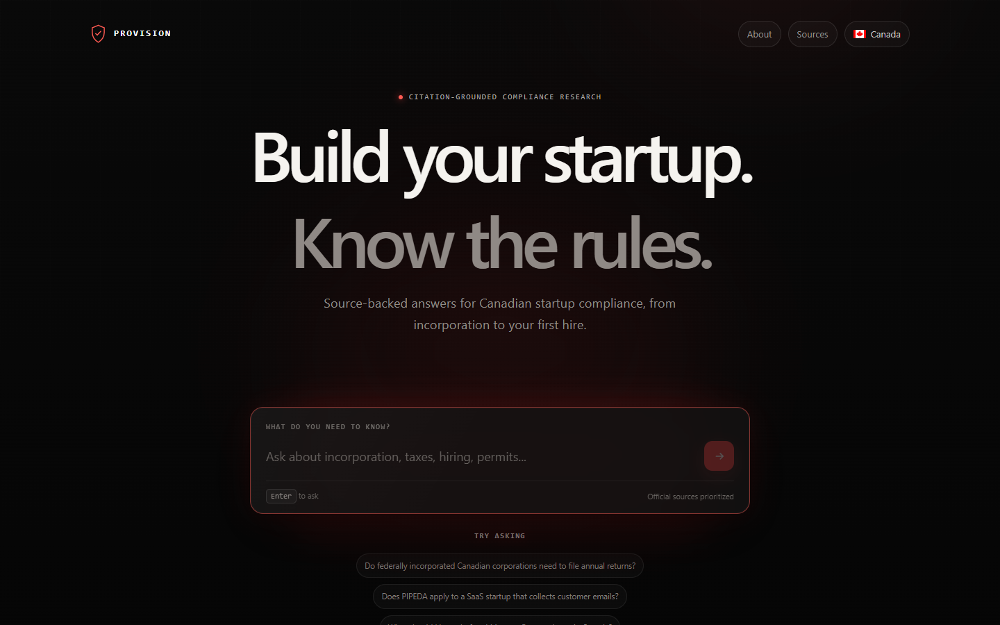
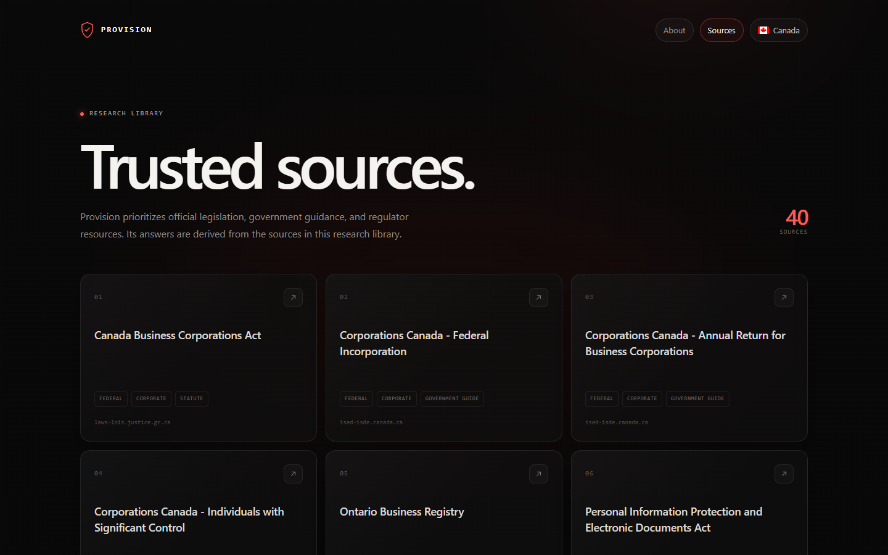

# Provision

Citation-grounded compliance research for Canadian startup founders.

Provision is a full-stack Retrieval-Augmented Generation (RAG) application that answers startup compliance questions from a curated library of Canadian government, legislation, and regulator sources. It returns a structured answer, practical checklist, source citations, risk level, and a professional-help warning when the question calls for one.

<p>
  
  
  
  
  
  
  
  
  
  
  
</p>

> [!IMPORTANT]
> Provision provides general information, not legal, tax, accounting, or employment advice. It does not determine that a business is compliant or replace a qualified professional.

## Preview

| Ask a compliance question | Browse the research library |
| --- | --- |
|  |  |

<!-- TODO: Add assets/provision-answer.png after the backend can successfully generate an answer locally. Capture the main page after asking a question so the image visibly includes the question, answer, checklist, risk indicator, and citation cards. Then add:  -->

## What Provision does

Provision helps a founder turn a broad compliance question into traceable research:

- searches an existing Chroma collection for relevant source chunks;
- limits generation to the retrieved context;
- returns inline chunk references and normalized citation metadata;
- highlights practical next steps as a checklist;
- reports insufficient context instead of silently filling gaps; and
- flags questions where legal, accounting, tax, or employment advice may be prudent.

Current coverage includes federal and Ontario material on incorporation, annual returns, individuals with significant control, privacy, CASL, tax, payroll, employment, intellectual property, permits and licences, cybersecurity, consumer protection, and related startup obligations.

## Key features

- **Citation-first answers** - every citation is linked back to trusted metadata from retrieval.
- **Curated source registry** - 60 sources are configured in `data/sources.json`; 40 are currently enabled.
- **Structured output** - Pydantic validates answers, checklists, citations, risk level, and safety flags.
- **Grounding guardrails** - the prompt prohibits outside knowledge and unsupported compliance claims.
- **Debuggable retrieval** - an environment-gated endpoint exposes chunks and similarity scores without generation.
- **Operational controls** - request validation, configurable rate limits, health checks, and a non-root Docker image.
- **Research observability** - LangSmith traces retrieval and answer generation; an evaluation suite tracks quality.

## Tech stack

| Layer | Technology |
| --- | --- |
| Web | Next.js 16, React 19, TypeScript, Tailwind CSS 4 |
| API | FastAPI, Pydantic, SlowAPI, Uvicorn |
| RAG | LangChain, OpenAI embeddings and chat models |
| Storage | Chroma persistent vector store |
| Extraction | Requests, Beautiful Soup, PyMuPDF |
| Evaluation | Custom evaluation runner, LangSmith tracing |
| Infrastructure | Docker, AWS EC2, Vercel |

## Architecture

```text
Browser
  |
  | POST /api/ask
  v
Next.js on Vercel
  | server-side proxy
  | POST /ask
  v
FastAPI container on AWS EC2
  |
  +--> Chroma similarity search <--> provision_vectorstore volume
  |         |
  |         +--> chunks + trusted source metadata
  |
  +--> grounded prompt --> OpenAI structured response
  |
  +--> citation normalization + safety fields
  v
Answer + checklist + citations + risk signals
```

Ingestion is deliberately separate from request handling. `POST /ask` reads an existing vector store; it never downloads, chunks, or embeds sources during a user request.

## RAG pipeline

```text
data/sources.json
  -> load enabled HTML/PDF sources
  -> clean and preserve source metadata
  -> recursively split documents into overlapping chunks
  -> embed with text-embedding-3-small
  -> persist in Chroma (provision_compliance)
  -> retrieve top-k chunks by similarity
  -> format evidence as untrusted source context
  -> generate a gpt-4.1-mini structured response
  -> replace model-supplied citations with retrieved metadata
```

Every source record carries an ID, title, URL, jurisdiction, topic, source type, and enabled flag. Chunk metadata adds stable chunk IDs and preserves the source fields needed by retrieval, evaluation, and the UI.

## Technical design decisions

- **Offline ingestion:** isolates expensive network and embedding work from API latency and avoids accidental re-ingestion per question.
- **Metadata-owned citations:** the model selects chunk IDs, but the application rebuilds citation objects from retrieved documents. This prevents model-authored titles or URLs from becoming trusted output.
- **Structured generation:** OpenAI JSON Schema output is validated as `ProvisionResponse`, giving the API and frontend a stable contract.
- **Explicit uncertainty:** empty or inadequate retrieval produces an insufficient-context response and can recommend professional review.
- **Server-side frontend proxy:** the browser calls Next.js `/api/ask`; only the server needs the backend URL.
- **Persistent vector storage:** the EC2 container can be replaced without rebuilding the Chroma collection stored in the Docker volume.
- **Restricted diagnostics:** `/retrieve-debug` is disabled by default and rate-limited when explicitly enabled.

## Project structure

```text
Provision/
|-- assets/                    # README screenshots
|-- backend/
|   |-- api/main.py            # FastAPI routes and request controls
|   |-- evals/                 # Evaluation set, runner, and results
|   |-- src/                   # Loading, chunking, ingestion, retrieval, generation
|   |-- Dockerfile
|   `-- requirements.txt
|-- data/sources.json          # Curated source registry
|-- docs/
|   |-- architecture.md
|   `-- evaluation.md
|-- frontend/
|   |-- src/app/               # Next.js pages and /api/ask proxy
|   |-- src/lib/sources.ts
|   `-- package.json
`-- README.md
```

## Example questions

- Do federally incorporated Canadian corporations need to file annual returns?
- What is an individual with significant control?
- Does PIPEDA apply to a SaaS startup that collects customer emails?
- What should I know before hiring my first employee in Ontario?
- Can Provision replace a lawyer for my startup?

## Data sources

The source registry prioritizes official material from organizations such as Justice Laws, Corporations Canada, the Canada Revenue Agency, the Office of the Privacy Commissioner of Canada, the CRTC, the Canadian Intellectual Property Office, and the Government of Ontario.

Edit `data/sources.json` to enable, disable, or add a source. Preserve this schema:

```json
{
  "id": "stable_source_id",
  "title": "Official source title",
  "url": "https://official.example/source",
  "jurisdiction": "federal",
  "topic": "corporate",
  "source_type": "government_guide",
  "enabled": true
}
```

## Evaluation and observability

`backend/evals/evaluate.py` runs 15 representative questions against retrieval and generation. The latest checked-in run completed with no execution errors and reported:

| Metric | Latest result |
| --- | ---: |
| Citation requirement | 84.6% (11/13) |
| Retrieval topic match | 26.7% (4/15) |
| Risk-level match | 46.7% (7/15) |
| Professional-help recommendation match | 60.0% (9/15) |

These are baseline results, not production-quality claims. The largest open quality work is improving retrieval/topic evaluation alignment and calibrating safety classifications. LangSmith `@traceable` spans are already present around retrieval and generation for query-level inspection.

See [`docs/evaluation.md`](docs/evaluation.md) for the evaluation contract and [`docs/architecture.md`](docs/architecture.md) for pipeline details.

## Local development

### 1. Configure and ingest the backend

Requirements: Python 3.12+, Node.js/npm, and an OpenAI API key.

```powershell
cd backend
python -m venv .venv
.\.venv\Scripts\Activate.ps1
python -m pip install -r requirements.txt
Copy-Item .env.example .env
```

Set real local values only in `backend/.env`:

```dotenv
OPENAI_API_KEY=your_openai_api_key
LANGSMITH_API_KEY=your_langsmith_api_key
LANGSMITH_TRACING=true
LANGSMITH_PROJECT=provision-local
```

Build the local vector store once:

```powershell
python src/ingest.py
```

Use `python src/ingest.py --reset` only when intentionally rebuilding an existing store. Ingestion downloads public sources and calls the embeddings API.

### 2. Test retrieval and answers

From `backend/`:

```powershell
python src/test_retrieval.py
python src/ask.py "Do federal corporations need to file annual returns?"
python evals/evaluate.py
```

### 3. Run the API

```powershell
uvicorn api.main:app --reload
```

The API exposes `GET /health`, `POST /ask`, and, when enabled, `POST /retrieve-debug`. Swagger UI is available at `http://127.0.0.1:8000/docs`.

### 4. Run the frontend

In a second terminal:

```powershell
cd frontend
npm install
Copy-Item .env.example .env.local
npm run dev
```

`frontend/.env.local` should use a server-reachable backend URL:

```dotenv
PROVISION_API_URL=http://127.0.0.1:8000
```

Open `http://localhost:3000`. The source catalogue is at `/sources` and project context is at `/about`.

## Docker backend

From the repository root:

```powershell
docker build -t provision-backend ./backend
docker volume create provision_vectorstore
```

Seed the persistent volume from the curated source registry:

```powershell
docker run --rm `
  --env-file backend/.env `
  -v provision_vectorstore:/app/vectorstore `
  -v "${PWD}/data:/data:ro" `
  provision-backend python src/ingest.py
```

Run the API:

```powershell
docker run -d `
  --name provision-api `
  --env-file backend/.env `
  -p 8000:8000 `
  -v provision_vectorstore:/app/vectorstore `
  provision-backend
```

The image runs as a non-root user and includes an HTTP health check. Secrets stay in `backend/.env` on the host and are supplied only at runtime.

## Deployment

- **Frontend:** Vercel project with `frontend` as the root directory.
- **Proxy configuration:** set `PROVISION_API_URL=http://<EC2_PUBLIC_IP>:8000` in Vercel; use an HTTPS endpoint before public production use to avoid mixed-content and transport-security issues.
- **Backend:** `provision-backend` image on AWS EC2, running as the `provision-api` container with `8000:8000` port mapping.
- **Persistence:** mount `provision_vectorstore:/app/vectorstore` and seed it during deployment or ingestion maintenance.
- **Source data:** mount `~/Provision/data:/data:ro` for containerized ingestion.
- **Secrets:** keep backend `.env` values on local machines or EC2 only. Never expose OpenAI or LangSmith keys through Vercel public variables or browser code.

## Future improvements

- Add hybrid or reranked retrieval and metadata filters for jurisdiction and topic.
- Expand provincial coverage beyond Ontario and add source freshness checks.
- Improve the evaluation taxonomy and add regression thresholds in CI.
- Add citation entailment and answer-faithfulness scoring.
- Place the EC2 API behind TLS, authentication, and managed ingress.
- Add background ingestion with source-change detection and versioned collections.
- Capture and add the answer-state screenshot once local generation is healthy.

## Disclaimer

Provision is an informational research tool. Its output may be incomplete, inaccurate, out of date, or inapplicable to a particular business or jurisdiction. It does not create a lawyer-client, accountant-client, fiduciary, or other professional relationship. Verify important information in the cited official sources and consult a qualified lawyer, accountant, or other professional before acting on high-risk matters or deadlines.
